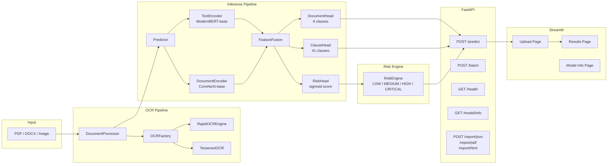
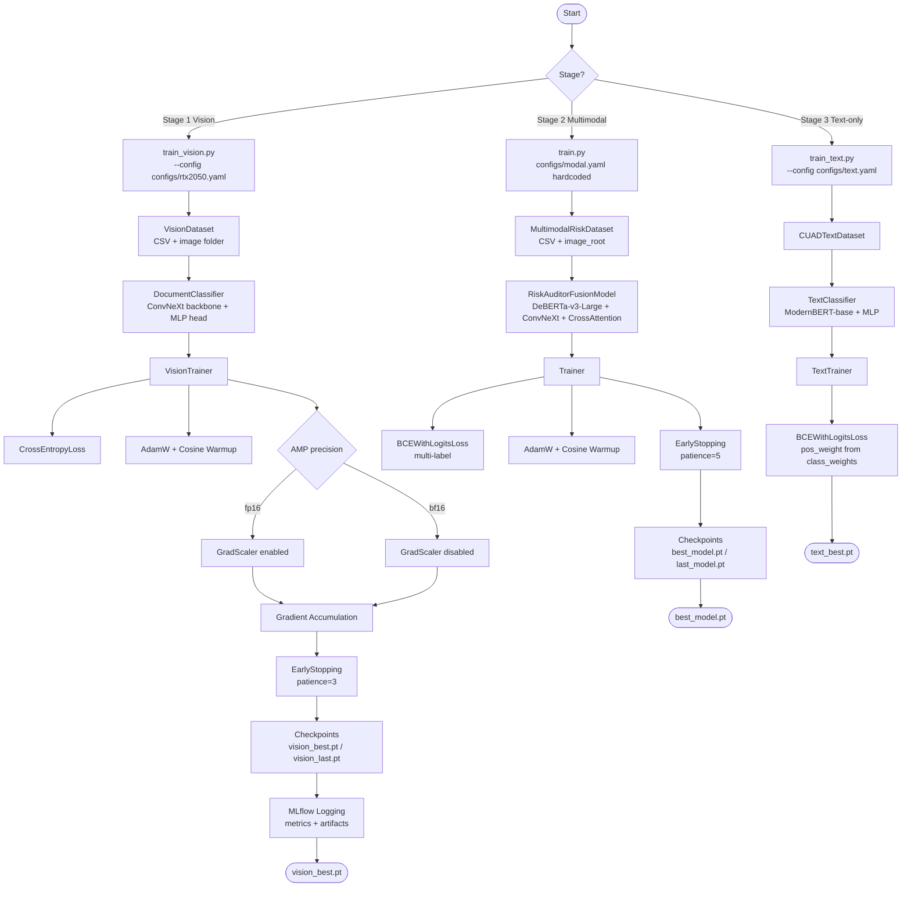
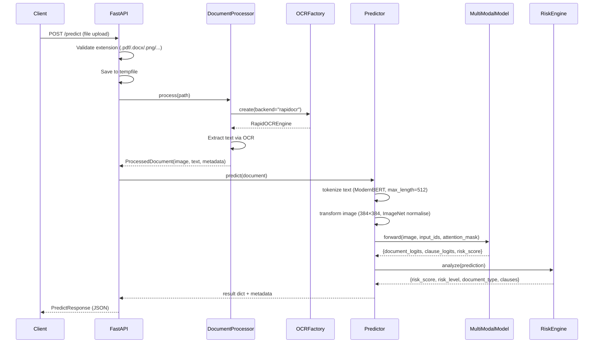
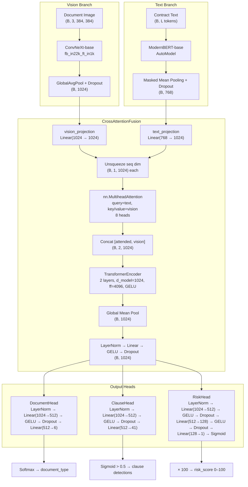
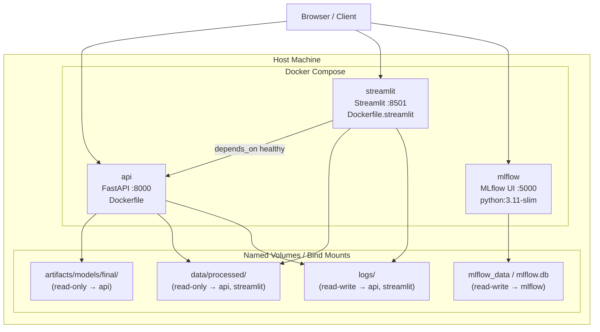
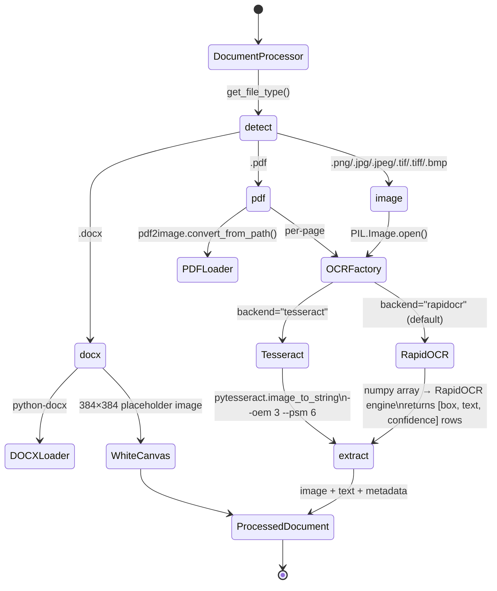
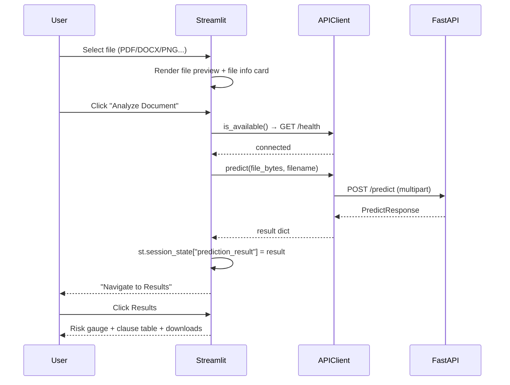

<div align="center">

# Multimodal Legal Risk Auditor

**A dual-stage ML system that combines document layout vision with contract text to detect and score legal risk across 41 clause categories.**

<br/>

[](https://www.python.org/)
[](https://pytorch.org/)
[](https://fastapi.tiangolo.com/)
[](https://streamlit.io/)
[](https://mlflow.org/)
[](https://www.docker.com/)
[](LICENSE)

</div>

---

## Table of Contents

- [Overview](#overview)
- [Features](#features)
- [Technology Stack](#technology-stack)
- [Repository Structure](#repository-structure)
- [Architecture](#architecture)
- [Dataset](#dataset)
- [Training](#training)
- [Evaluation](#evaluation)
- [Model Architecture](#model-architecture)
- [OCR Pipeline](#ocr-pipeline)
- [FastAPI](#fastapi)
- [Streamlit](#streamlit)
- [Reports](#reports)
- [Logging](#logging)
- [MLflow](#mlflow)
- [Configuration](#configuration)
- [Docker](#docker)
- [Installation](#installation)
- [Usage](#usage)
- [Testing](#testing)
- [Roadmap](#roadmap)
- [Contributing](#contributing)

---

## Overview

Commercial agreements contain dozens of clause types that carry substantially different legal and financial risk profiles. Reviewing them manually is slow, inconsistent, and expensive. The **Multimodal Legal Risk Auditor** automates this process by running two cooperating machine learning pipelines:

| Stage | Input | Task |
|---|---|---|
| **Stage 1 — Vision** | Document page scans | Classify page layout into 6 document types |
| **Stage 2 — Multimodal** | Contract text + page image | Detect 41 legal risk clause types; emit a composite risk score |

The system is purpose-built for contract management teams, legal operations functions, and risk auditors who need to triage large volumes of agreements quickly. From a research standpoint it demonstrates cross-attention-based multimodal fusion (ConvNeXt + ModernBERT) applied to a specialized legal NLP domain.

**Data source:** [CUAD v1](https://www.atticusprojectai.org/cuad) — 510 commercial agreements hand-annotated across 41 legal clause categories.

---

## Features

### Machine Learning
- Two independent training pipelines: vision-only (Stage 1) and multimodal (Stage 2)
- AdamW optimiser with cosine warmup scheduling (`transformers.get_cosine_schedule_with_warmup`)
- Mixed-precision autocast — `bf16` for cloud GPUs (Modal), `fp16` for local GPUs (RTX series)
- Gradient accumulation with configurable accumulation steps
- Automatic gradient scaling (GradScaler, enabled only for fp16)
- Early stopping on validation loss with configurable patience
- Full checkpoint serialisation: model, optimiser, scheduler, and epoch state

### Computer Vision
- `timm`-backed `DocumentEncoder` supporting any TIMM backbone (ConvNeXt, ResNet, Swin, EfficientNetV2, etc.)
- Global average pooling to produce flat document feature vectors
- `channels_last` memory format applied by `VisionTrainer` for ConvNeXt throughput
- Stratified 80/10/10 train/val/test split for vision datasets

### OCR
- Factory pattern (`OCRFactory`) with two pluggable backends: **RapidOCR** (ONNX Runtime) and **Tesseract**
- RapidOCR is the default; Tesseract available as an alternative via `OCRFactory.create(backend="tesseract")`
- Supports PDF (via `pdf2image` / Poppler), DOCX (via `python-docx`), PNG, JPG, JPEG, TIFF, BMP
- OCR text is included in all prediction responses and report exports

### NLP
- `TextEncoder` wraps any Hugging Face `AutoModel` backbone
- Default inference backbone: `answerdotai/ModernBERT-base`
- Masked mean pooling over the full token sequence (not just `[CLS]`)
- Gradient checkpointing enabled on the text backbone to reduce VRAM usage
- Separate `TextClassifier` (ModernBERT + MLP head) for text-only training pipeline

### Multimodal
- `CrossAttentionFusion`: text features query vision features via `nn.MultiheadAttention`
- Concatenates cross-attended and original vision representations, then passes through a 2-layer TransformerEncoder
- Global average pooling + LayerNorm + Dropout fusion head
- `FeatureFusion` (simple projection + concat) used in the inference `MultiModalModel`

### Backend
- FastAPI application with lifespan management, CORS, and structured exception handlers
- `RequestLoggingMiddleware`: logs every HTTP request with method, path, client IP, duration, status
- `ErrorHandlingMiddleware`: catches unhandled exceptions and returns structured JSON `500` responses
- Dependency-injection pattern (`get_predictor`, `get_processor`) for clean testability

### Frontend
- Five-page Streamlit dashboard: Home, Upload, Results, Model Info, Settings
- Real-time API health indicator in the sidebar
- Plotly risk gauge chart, clause probability table, OCR text viewer, inference metadata display
- One-click download for JSON, PDF, and HTML reports

### Deployment
- `Dockerfile` (FastAPI) and `Dockerfile.streamlit` — both based on `python:3.11-slim`
- System packages: `poppler-utils` (PDF), `tesseract-ocr`, `libgl1-mesa-glx`
- Docker Compose: three services — `api`, `streamlit`, `mlflow` — with healthchecks and `depends_on`
- GPU deployment supported via commented NVIDIA runtime block in `docker-compose.yml`

### Monitoring
- MLflow experiment tracking with SQLite backend (`mlflow.db`)
- Per-epoch logging of all loss and metric values
- Artifact logging (`mlflow.log_artifact`, `mlflow.log_artifacts`) for checkpoints and plots
- MLflow service included in Docker Compose on port 5000

### Testing
- `conftest.py` provides shared fixtures: mock `Predictor`, mock `DocumentProcessor`, `TestClient`, sample PDF bytes, sample PNG bytes
- Smoke tests (`tests/smoke/test_smoke.py`): module-level import verification + health/version endpoint checks
- Integration tests (`tests/integration/test_api_inference.py`): end-to-end upload→predict pipeline via `TestClient`

---

## Technology Stack

| Category | Library / Tool | Version |
|---|---|---|
| Language | Python | 3.11 |
| Deep Learning | PyTorch | ≥ 2.0 |
| Deep Learning | TorchVision | ≥ 0.15 |
| Vision Backbone | timm (ConvNeXt, ResNet, Swin, …) | ≥ 0.9 |
| Text Backbone | Hugging Face Transformers | ≥ 4.30 |
| Text Model | ModernBERT (`answerdotai/ModernBERT-base`) | — |
| Text Model | DeBERTa-v3-Large (`microsoft/deberta-v3-large`) | — |
| API Framework | FastAPI + Uvicorn | ≥ 0.100 |
| Frontend | Streamlit | ≥ 1.28 |
| Visualisation | Plotly | ≥ 5.15 |
| OCR (primary) | RapidOCR ONNX Runtime | ≥ 1.3 |
| OCR (alternative) | Tesseract / pytesseract | — |
| PDF Rendering | pdf2image (Poppler) | ≥ 1.16 |
| DOCX Parsing | python-docx | ≥ 0.8 |
| Experiment Tracking | MLflow | ≥ 2.5 |
| Data | Pandas | ≥ 2.0 |
| Data | NumPy | ≥ 1.24 |
| Metrics | Scikit-learn | ≥ 1.3 |
| Image Processing | Pillow | ≥ 10.0 |
| Report Generation | ReportLab | ≥ 4.0 |
| Serialisation | SafeTensors | ≥ 0.3 |
| Schema Validation | Pydantic | ≥ 2.0 |
| Containerisation | Docker + Docker Compose | — |
| Testing | Pytest + pytest-asyncio + httpx | ≥ 7.4 |

---

## Repository Structure

```
multi_modal/
├── configs/                         # YAML configuration profiles
│   ├── modal.yaml                   # Cloud GPU (Modal) — bf16, large backbones, batch 64
│   ├── rtx2050.yaml                 # Local GPU (RTX 2050) — fp16, frozen encoders, batch 2
│   ├── text.yaml                    # Text-only pipeline — ModernBERT, 30 epochs
│   ├── development.yaml             # (template — empty)
│   ├── production.yaml              # (template — empty)
│   └── rtx3090.yaml                 # (template — empty)
│
├── data/
│   ├── raw/                         # Source datasets (CUAD JSON, raw document images)
│   └── processed/                   # Generated CSVs and class/clause mapping JSONs
│
├── scripts/                         # Standalone data preparation utilities
│   ├── prep_cuad.py                 # Parse CUADv1.json → train/val/test CSVs + clause_mapping.json
│   ├── prepare_vision_dataset.py    # Scan image folders → stratified vision splits
│   └── convert_vision_csv_to_relative.py  # Fix absolute paths in vision CSVs
│
├── src/
│   ├── api/                         # FastAPI application
│   │   ├── app.py                   # Application factory, lifespan, CORS, exception handlers
│   │   ├── routes.py                # All endpoint definitions
│   │   ├── schemas.py               # Pydantic request/response models
│   │   ├── middleware.py            # RequestLoggingMiddleware, ErrorHandlingMiddleware
│   │   └── dependencies.py         # Dependency-injection providers
│   │
│   ├── data/                        # PyTorch datasets and data utilities
│   │   ├── dataset.py               # MultimodalRiskDataset (text + image + labels)
│   │   ├── vision_dataset.py        # VisionDataset (image + label)
│   │   ├── text_dataset.py          # CUADTextDataset (tokenised text + labels)
│   │   ├── collate.py               # multimodal_collate_fn
│   │   └── transforms.py            # build_image_transform
│   │
│   ├── models/                      # Neural network architectures
│   │   ├── multimodal_model.py      # MultiModalModel — inference model with 3 output heads
│   │   ├── risk_auditor.py          # RiskAuditorFusionModel — training model (41-label)
│   │   ├── document_encoder.py      # DocumentEncoder — timm vision backbone wrapper
│   │   ├── text_encoder.py          # TextEncoder — HF AutoModel + masked mean pooling
│   │   ├── text_classifier.py       # TextClassifier — text-only ModernBERT + MLP
│   │   ├── document_classifier.py   # DocumentClassifier — vision-only layout classifier
│   │   ├── fusion.py                # CrossAttentionFusion
│   │   ├── feature_fusion.py        # FeatureFusion (concat-based, used at inference)
│   │   └── risk_head.py             # RiskHead — sigmoid scalar risk score predictor
│   │
│   ├── training/                    # Training loops, metrics, callbacks
│   │   ├── trainer.py               # Multimodal Trainer — AMP, grad accum, early stopping
│   │   ├── vision_trainer.py        # VisionTrainer — channels_last, top-k metrics
│   │   ├── text_trainer.py          # TextTrainer — text-only pipeline
│   │   ├── metrics.py               # compute_vision_metrics, compute_multilabel_metrics
│   │   ├── text_metrics.py          # Text-specific metric helpers
│   │   ├── losses.py                # build_loss (CrossEntropyLoss / BCEWithLogitsLoss)
│   │   ├── callbacks.py             # EarlyStopping, save_checkpoint, load_checkpoint
│   │   ├── checkpoint.py            # CheckpointManager class
│   │   └── vision/                  # Vision-specific submodule
│   │       ├── metrics.py           # compute_metrics (accuracy, top-k, F1, confusion matrix)
│   │       ├── mlflow_utils.py      # initialize_mlflow, log_parameters, log_metrics
│   │       ├── early_stopping.py    # EarlyStopping for vision trainer
│   │       ├── checkpoint.py        # Vision checkpoint helpers
│   │       └── evaluator.py         # Vision evaluation loop
│   │
│   ├── inference/                   # Production inference pipeline
│   │   ├── predictor.py             # Predictor — tokenise, transform, forward, risk analysis
│   │   ├── document_processor.py    # DocumentProcessor — file type dispatch, OCR call
│   │   ├── risk_engine.py           # RiskEngine — logit → risk score/level/recommendation
│   │   ├── model_loader.py          # load_multimodal_model — loads encoder weights
│   │   ├── ocr_factory.py           # OCRFactory.create(backend="rapidocr"|"tesseract")
│   │   ├── rapidocr_ocr.py          # RapidOCREngine
│   │   ├── tesseract_ocr.py         # TesseractOCR
│   │   ├── pdf_loader.py            # PDFLoader (pdf2image)
│   │   ├── docx_loader.py           # DOCXLoader (python-docx)
│   │   └── document.py              # ProcessedDocument dataclass
│   │
│   ├── reports/                     # Downloadable report generators
│   │   ├── json_report.py           # generate_json_report → structured JSON string
│   │   ├── html_report.py           # generate_html_report → standalone HTML with CSS
│   │   └── pdf_report.py            # generate_pdf_report → PDF bytes via ReportLab
│   │
│   ├── utils/                       # Shared utilities
│   │   ├── config.py                # load_config — YAML → dot-notation Config object
│   │   ├── device.py                # get_device
│   │   ├── seed.py                  # set_seed (NumPy, Python, PyTorch)
│   │   ├── logging_config.py        # Rotating loggers: app, api, requests, errors
│   │   ├── class_weights.py         # compute_pos_weights for BCEWithLogitsLoss
│   │   └── model_summary.py         # model_summary helper
│   │
│   ├── train.py                     # Stage 2 — Multimodal training entrypoint
│   ├── train_vision.py              # Stage 1 — Vision training entrypoint (CLI --config)
│   └── train_text.py                # Text-only training entrypoint (CLI --config)
│
├── streamlit_app/
│   ├── app.py                       # Main Streamlit app — navigation, API client init
│   ├── api_client.py                # APIClient — wraps all FastAPI calls
│   ├── pages/
│   │   ├── home.py                  # Home / landing page
│   │   ├── upload.py                # Document upload and prediction trigger
│   │   ├── results.py               # Risk gauge, clauses, OCR text, downloads
│   │   ├── model_info.py            # Model architecture, parameter counts
│   │   └── settings.py             # API URL config, session state debug
│   ├── components/                  # Reusable Streamlit UI components
│   └── styles/                      # Custom CSS theme
│
├── tests/
│   ├── conftest.py                  # Shared fixtures: mock predictor, test client, sample bytes
│   ├── smoke/
│   │   └── test_smoke.py            # Import checks + health/version endpoint smoke tests
│   └── integration/
│       └── test_api_inference.py    # End-to-end upload→predict integration tests
│
├── Dockerfile                       # FastAPI image (python:3.11-slim + Poppler + Tesseract)
├── Dockerfile.streamlit             # Streamlit image
├── docker-compose.yml               # api + streamlit + mlflow services
├── .env.docker                      # Docker environment variable defaults
├── .env.example                     # Environment variable template
├── mlflow.db                        # SQLite MLflow backend (local tracking)
├── mlruns/                          # Local MLflow fallback storage
└── requirements.txt                 # Pinned Python dependencies
```

---

## Architecture

### High-Level System Overview



---

### Training Pipeline



---

### Inference Pipeline



---

### Model Architecture



---

### Deployment Architecture



---

### Dependency Graph

```mermaid
graph TD
    TV[train_vision.py] --> UC[utils/config.py]
    TV --> US[utils/seed.py]
    TV --> UD[utils/device.py]
    TV --> VD[data/vision_dataset.py]
    TV --> DC[models/document_classifier.py]
    TV --> VT[training/vision_trainer.py]
    DC --> DE[models/document_encoder.py]
    DE --> TIMM[timm]
    VT --> VM[training/vision/metrics.py]
    VT --> VE[training/vision/early_stopping.py]
    VT --> VC[training/vision/checkpoint.py]
    VT --> MF[training/vision/mlflow_utils.py]
    VM --> SK[sklearn.metrics]

    TM[train.py] --> UC
    TM --> US
    TM --> UD
    TM --> MD[data/dataset.py]
    TM --> CF[data/collate.py]
    TM --> RA[models/risk_auditor.py]
    TM --> LS[training/losses.py]
    TM --> TR[training/trainer.py]
    RA --> DE
    RA --> TE[models/text_encoder.py]
    RA --> FU[models/fusion.py]
    TE --> HF[transformers.AutoModel]
    TR --> CB[training/callbacks.py]
    TR --> ME[training/metrics.py]
    ME --> SK

    TT[train_text.py] --> TC[data/text_dataset.py]
    TT --> TX[models/text_classifier.py]
    TT --> TXT[training/text_trainer.py]
    TX --> TE

    API[api/app.py] --> RT[api/routes.py]
    RT --> PR[inference/predictor.py]
    RT --> DP[inference/document_processor.py]
    PR --> ML[inference/model_loader.py]
    PR --> RE[inference/risk_engine.py]
    ML --> MM[models/multimodal_model.py]
    DP --> OF[inference/ocr_factory.py]
    OF --> RO[inference/rapidocr_ocr.py]
    OF --> TO[inference/tesseract_ocr.py]
    RT --> RPT[reports/json_report.py]
    RT --> RPT2[reports/html_report.py]
    RT --> RPT3[reports/pdf_report.py]
```



---

## Dataset

### Stage 1 — Vision Document Classification

| Property | Value |
|---|---|
| Source | Raw document page images in class-named subdirectories |
| Classes | `budget`, `form`, `invoice`, `letter`, `memo`, `specification` |
| Label format | Integer index (0–5), stored in `class_mapping.json` |
| Split | 80% train / 10% val / 10% test (stratified) |
| Preprocessing script | `scripts/prepare_vision_dataset.py` |

**Training augmentations:**

| Transform | Parameters |
|---|---|
| Resize | `image_size × image_size` |
| RandomHorizontalFlip | p = 0.5 |
| RandomRotation | degrees = 5 |
| RandomAffine | translate = (0.02, 0.02), scale = (0.95, 1.05) |
| ColorJitter | brightness = 0.10, contrast = 0.10 |
| ToTensor | — |
| Normalize | mean = [0.485, 0.456, 0.406], std = [0.229, 0.224, 0.225] |

**Validation / inference augmentations:** Resize → ToTensor → Normalize (ImageNet stats only).

---

### Stage 2 — Multimodal Legal Risk Auditing

| Property | Value |
|---|---|
| Source | [CUAD v1](https://www.atticusprojectai.org/cuad) — `data/raw/cuad-main/data/CUADv1.json` |
| Task | Multi-label classification (41 legal clause categories) |
| Label format | Binary columns prefixed `label::<ClauseType>` |
| Split | 72% train / 8% val / 20% test (random, seed = 42) |
| Preprocessing script | `scripts/prep_cuad.py` |
| Output | `data/processed/train.csv`, `val.csv`, `test.csv`, `clause_mapping.json` |

**Clause mapping:** `clause_mapping.json` maps integer index → clause name (41 entries). Examples include *Termination For Convenience*, *Non-Compete*, *Most Favored Nation*, *Change Of Control*, *Revenue/Profit Sharing*.

**Data loading flow:**
1. `CUADTextDataset` / `MultimodalRiskDataset` reads CSVs into Pandas DataFrames.
2. Contract text is tokenised up to `max_length` tokens using `AutoTokenizer.from_pretrained(tokenizer_name)`.
3. Images are loaded from `image_root / f"{title}.png"`. Missing or corrupt images silently fall back to a white `(384, 384)` canvas.
4. Each sample yields `{input_ids, attention_mask, pixel_values, labels}`.
5. `multimodal_collate_fn` stacks variable-length batches into padded tensors.

---

### Stage 3 — Text-Only Pipeline

| Property | Value |
|---|---|
| Dataset class | `CUADTextDataset` |
| Model | `TextClassifier` (ModernBERT-base + MLP) |
| Config | `configs/text.yaml` |
| Loss | `BCEWithLogitsLoss` with per-label `pos_weight` from `compute_pos_weights` |

---

## Training

### Stage 1 — Vision Classifier (`train_vision.py`)

```bash
python src/train_vision.py --config configs/rtx2050.yaml
```

| Component | Detail |
|---|---|
| Model | `DocumentClassifier` (ConvNeXt backbone + LayerNorm → Linear → GELU → Dropout × 2 → Linear) |
| Loss | `nn.CrossEntropyLoss` |
| Optimiser | AdamW |
| Scheduler | Cosine with linear warmup (`warmup_ratio × total_steps`) |
| AMP | fp16 (RTX2050) or bf16 (Modal) |
| Memory format | `torch.channels_last` (ConvNeXt optimisation) |
| Checkpoints | `artifacts/checkpoints/best/vision_best.pt`, `artifacts/checkpoints/last/vision_last.pt` |
| Final export | `artifacts/models/final/document_encoder.pt` |

---

### Stage 2 — Multimodal Auditor (`train.py`)

```bash
python src/train.py
```

> Config path is hardcoded to `configs/modal.yaml`. Edit `src/train.py` line 27 to switch profiles.

| Component | Detail |
|---|---|
| Model | `RiskAuditorFusionModel` (DeBERTa-v3-Large + ConvNeXt-base + CrossAttentionFusion + MLP) |
| Loss | `nn.BCEWithLogitsLoss` (multi-label) |
| Optimiser | AdamW, lr = 2e-5, weight_decay = 0.01 |
| Scheduler | Cosine warmup (warmup_ratio = 0.1) |
| AMP | bf16 (Modal) |
| Gradient accumulation | Configurable via `training.gradient_accumulation_steps` |
| Early stopping | Validation loss, patience = 5 |
| Checkpoints | `best_model.pt`, `last_model.pt` under `paths.checkpoint_dir` |

---

### Stage 3 — Text Classifier (`train_text.py`)

```bash
python src/train_text.py --config configs/text.yaml
```

| Component | Detail |
|---|---|
| Model | `TextClassifier` (ModernBERT-base + MLP head) |
| Loss | `BCEWithLogitsLoss` with computed `pos_weight` tensors |
| Epochs | 30 |
| Gradient accumulation | 8 steps (effective batch = 16) |

---

### Common Trainer Mechanisms

| Feature | Implementation |
|---|---|
| Mixed precision | `torch.amp.autocast("cuda", dtype=torch.bfloat16 or float16)` |
| Gradient scaling | `torch.cuda.amp.GradScaler` (fp16 only; bf16 does not require scaling) |
| Gradient clipping | Applied before each optimiser step |
| Persistent workers | Enabled when `config.training.persistent_workers = true` and CUDA is available |
| Memory pinning | `pin_memory = torch.cuda.is_available()` |
| Reproducibility | `set_seed` — seeds Python `random`, NumPy, PyTorch, and CUDA |

---

## Evaluation

### Vision Metrics (`src/training/vision/metrics.py`, `src/training/metrics.py`)

| Metric | Description |
|---|---|
| `accuracy` | Standard top-1 classification accuracy |
| `top3_accuracy` | Top-3 accuracy via `sklearn.top_k_accuracy_score` |
| `top5_accuracy` | Top-5 accuracy via `sklearn.top_k_accuracy_score` |
| `precision` | Macro-average precision (zero_division=0) |
| `recall` | Macro-average recall (zero_division=0) |
| `f1` | Macro-average F1 (zero_division=0) |
| `confusion_matrix` | Full NxN confusion matrix |
| `classification_report` | Per-class dict from `sklearn.classification_report` |

### Multimodal Metrics (`src/training/metrics.py` — `compute_multilabel_metrics`)

Predictions are computed as `sigmoid(logits) >= threshold` (default threshold = 0.5).

| Metric | Description |
|---|---|
| `subset_accuracy` | Exact match: fraction of samples where **all** 41 labels match |
| `label_accuracy` | Element-wise mean accuracy across all 41 label positions |
| `precision` | Macro-average multi-label precision |
| `recall` | Macro-average multi-label recall |
| `f1` | Macro-average multi-label F1 |
| `hamming_loss` | Fraction of labels incorrectly predicted |
| `jaccard` | Sample-average Jaccard similarity coefficient |
| `roc_auc` | Macro-average ROC-AUC (probability-based) |
| `pr_auc` | Macro-average Precision-Recall AUC (probability-based) |

`roc_auc` and `pr_auc` are wrapped in `try/except` to handle degenerate batches.

---

## Model Architecture

### `DocumentEncoder` — Vision Backbone

```
Input: (B, 3, H, W)   [H = W = image_size; 224 local, 384 cloud]
  └─ timm.create_model(backbone, pretrained=True, num_classes=0, global_pool="avg")
  └─ nn.Dropout(dropout)
Output: (B, feature_dim)   [1024 for ConvNeXt-base]
```

Supports any TIMM backbone: `convnext_base.fb_in22k_ft_in1k`, `resnet18`, `swin_large_patch4_window12_384`, `efficientnetv2_l`, etc.

---

### `TextEncoder` — Text Backbone

```
Input: input_ids (B, L), attention_mask (B, L)
  └─ AutoModel.from_pretrained(model_name)   [ModernBERT-base by default]
       └─ gradient_checkpointing_enable()
  └─ Masked Mean Pooling:
       token_embeddings = outputs.last_hidden_state
       pooled = (token_embeddings * mask).sum(dim=1) / mask.sum(dim=1)
  └─ nn.Dropout(dropout)
Output: (B, hidden_size)   [768 for ModernBERT-base]
```

---

### `CrossAttentionFusion`

```
Inputs: vision_features (B, 1024), text_features (B, 768)
  └─ vision_projection: Linear(1024 → 1024)
  └─ text_projection:   Linear(768  → 1024)
  └─ Unsqueeze → (B, 1, 1024) each
  └─ nn.MultiheadAttention(query=text, key=vision, value=vision, heads=8)
       → attended: (B, 1, 1024)
  └─ Concat([attended, vision]) → (B, 2, 1024)
  └─ TransformerEncoder(2 layers, d_model=1024, ffn=4096, GELU)
  └─ Mean pool → (B, 1024)
  └─ LayerNorm → Linear(1024→1024) → GELU → Dropout
Output: (B, 1024)
```

---

### `MultiModalModel` — Inference Model (3 heads)

```python
{
    "vision_features":  (B, 1024),   # ConvNeXt features
    "text_features":    (B, 768),    # ModernBERT features
    "fused_features":   (B, 1024),   # FeatureFusion output
    "document_logits":  (B, 6),      # Layout classification
    "clause_logits":    (B, 41),     # Risk clause detection
    "risk_score":       (B, 1),      # Sigmoid scalar [0, 1]
}
```

### `RiskAuditorFusionModel` — Training Model

```python
# Forward output: logits tensor (B, 41)
# Uses CrossAttentionFusion instead of FeatureFusion
# Classifier head: LayerNorm → Linear(1024→1024) → GELU → Dropout
#                            → Linear(1024→512)  → GELU → Dropout
#                            → Linear(512→41)
```

---

## OCR Pipeline



| Format | Loader | OCR |
|---|---|---|
| `.png`, `.jpg`, `.jpeg`, `.tif`, `.tiff`, `.bmp` | `PIL.Image.open()` | RapidOCR or Tesseract |
| `.pdf` | `pdf2image` (Poppler required) | RapidOCR or Tesseract per page |
| `.docx` | `python-docx` paragraph extraction | None (text extracted directly) |

The factory default is `RapidOCREngine`. Switch backends by passing `backend="tesseract"` to `OCRFactory.create()`.

---

## FastAPI

The API runs via Uvicorn on port `8000`. All endpoints are registered in `src/api/routes.py`.

### Endpoints

| Method | Path | Tag | Description |
|---|---|---|---|
| `GET` | `/health` | System | API health, device status, model loaded flag |
| `GET` | `/version` | System | API version, Python, PyTorch, CUDA info |
| `GET` | `/model/info` | System | Backbone names, parameter counts, device |
| `POST` | `/predict` | Prediction | Single-file risk analysis |
| `POST` | `/batch` | Prediction | Multi-file batch risk analysis |
| `POST` | `/report/json` | Reports | Generate + download JSON report |
| `POST` | `/report/pdf` | Reports | Generate + download PDF report |
| `POST` | `/report/html` | Reports | Generate + download HTML report |

### Supported File Types

`.pdf` · `.docx` · `.png` · `.jpg` · `.jpeg` · `.tif` · `.tiff` · `.bmp`

---

### Request / Response Schemas

<details>
<summary><strong>GET /health</strong></summary>

**Response:**
```json
{
  "status": "ok",
  "device": "cuda",
  "model_loaded": true
}
```

</details>

<details>
<summary><strong>GET /version</strong></summary>

**Response:**
```json
{
  "api_version": "1.0.0",
  "python_version": "3.11.9",
  "pytorch_version": "2.3.0",
  "cuda_available": true,
  "cuda_version": "12.1"
}
```

</details>

<details>
<summary><strong>GET /model/info</strong></summary>

**Response:**
```json
{
  "model_name": "MultiModalModel",
  "vision_backbone": "convnext_base.fb_in22k_ft_in1k",
  "text_backbone": "answerdotai/ModernBERT-base",
  "document_classes": 6,
  "clause_classes": 41,
  "device": "cuda",
  "total_parameters": 234567890,
  "trainable_parameters": 234567890
}
```

</details>

<details>
<summary><strong>POST /predict</strong></summary>

**Request:** `multipart/form-data` — field `file` containing the document.

```bash
curl -X POST http://localhost:8000/predict \
  -F "file=@contract.pdf"
```

**Response:**
```json
{
  "risk_score": 67.5,
  "risk_level": "HIGH",
  "document_type": "letter",
  "confidence": 89.3,
  "recommendation": "Legal review recommended before signing.",
  "high_risk_clauses": [
    { "clause": "Termination For Convenience", "probability": 0.85 },
    { "clause": "Non-Compete", "probability": 0.72 },
    { "clause": "Most Favored Nation", "probability": 0.61 }
  ],
  "source": "/tmp/tmpXXXXXX.pdf",
  "file_type": "pdf",
  "filename": "contract.pdf",
  "page_count": 3,
  "ocr_engine": "RapidOCREngine",
  "ocr_text": "AGREEMENT dated as of...",
  "execution_time_seconds": 1.2345
}
```

</details>

<details>
<summary><strong>POST /batch</strong></summary>

**Request:** `multipart/form-data` — field `files` (multiple files).

```bash
curl -X POST http://localhost:8000/batch \
  -F "files=@doc1.pdf" \
  -F "files=@doc2.png"
```

**Response:**
```json
{
  "results": [ { "...": "..." }, { "...": "..." } ],
  "total_files": 2,
  "total_execution_time_seconds": 2.345
}
```

</details>

### Risk Score Interpretation

| Score Range | Risk Level | Recommendation |
|---|---|---|
| 0 – 24 | `LOW` | No major legal issues detected. |
| 25 – 49 | `MEDIUM` | Review highlighted clauses. |
| 50 – 74 | `HIGH` | Legal review recommended before signing. |
| 75 – 100 | `CRITICAL` | Do not sign without legal counsel. |

---

## Streamlit

Launch with:

```bash
streamlit run streamlit_app/app.py
```

The dashboard connects to the FastAPI backend at `http://localhost:8000` by default (configurable via the Settings page).

### Pages

| Page | Route | Description |
|---|---|---|
| **Home** | `🏠 Home` | Landing page with API status indicator |
| **Upload** | `📤 Upload` | File uploader, inline preview, Analyze button |
| **Results** | `📊 Results` | Plotly risk gauge, clause table, OCR text viewer, metadata, report downloads |
| **Model Info** | `🧠 Model Info` | Backbone names, parameter counts, architecture ASCII diagram |
| **Settings** | `⚙️ Settings` | API base URL configuration, connection tester, session state debug |

### Upload Workflow



### Report Downloads (Results Page)

The Results page provides three download buttons:

| Format | Generator | Content |
|---|---|---|
| **JSON** | `generate_json_report` | Structured JSON with metadata, risk assessment, clauses, OCR text |
| **PDF** | `generate_pdf_report` (ReportLab) | Printable PDF with risk score, clause table, OCR excerpt |
| **HTML** | `generate_html_report` | Standalone HTML with embedded CSS, risk gauge, clause probability bars |

---

## Reports

### JSON Report

Generated by `src/reports/json_report.py` → `generate_json_report(result)`.

```json
{
  "report_metadata": {
    "generated_at": "2026-06-26T14:20:00+00:00",
    "report_type": "Legal Risk Audit",
    "version": "1.0.0"
  },
  "document_info": { "filename": "...", "file_type": "...", "page_count": 3, "ocr_engine": "..." },
  "risk_assessment": { "risk_score": 67.5, "risk_level": "HIGH", "recommendation": "..." },
  "document_classification": { "document_type": "letter", "confidence": 89.3 },
  "detected_clauses": [ { "clause": "...", "probability": 0.85 } ],
  "extracted_text": "...",
  "execution": { "execution_time_seconds": 1.234 }
}
```

### HTML Report

Generated by `src/reports/html_report.py` → `generate_html_report(result)`.

A fully self-contained HTML document with embedded CSS. Includes:
- Risk score displayed with colour-coded level indicator
- Document information grid
- Clause table with inline probability bars
- OCR text section (HTML-escaped)
- Print-optimised `@media print` stylesheet

### PDF Report

Generated by `src/reports/pdf_report.py` → `generate_pdf_report(result)`.

Uses ReportLab to produce a PDF with the same structural content as the HTML report. Returns raw `bytes`.

---

## Logging

The logging system is implemented in `src/utils/logging_config.py`. All loggers use `RotatingFileHandler` (10 MB per file, 5 backups) and `StreamHandler` (stdout).

| Logger | File | Level | Used by |
|---|---|---|---|
| `app` | `logs/app.log` | INFO | General application events |
| `api` | `logs/api.log` | INFO | FastAPI app events (startup, shutdown, exceptions) |
| `requests` | `logs/requests.log` | INFO | `RequestLoggingMiddleware` — method, path, client IP, duration, status |
| `errors` | `logs/errors.log` | ERROR | `ErrorHandlingMiddleware` — unhandled exceptions with full tracebacks |

Log format:
```
2026-06-26T14:20:00+0000 | INFO     | api | POST /predict | client=127.0.0.1 | duration=1.2345s | status=200
```

---

## MLflow

MLflow tracks experiments with a SQLite backend at `mlflow.db`.

### Initialisation

```python
# src/training/vision/mlflow_utils.py
initialize_mlflow(experiment_name="multimodal-risk-auditor-modal")
# Sets tracking URI: sqlite:///mlflow.db
```

### What Is Logged

| Category | Details |
|---|---|
| **Parameters** | `model`, `max_length`, `image_size`, `learning_rate`, `epochs`, `batch_size`, `mixed_precision`, `gradient_accumulation` |
| **Metrics** | All loss and score values per epoch (confusion matrix is skipped) |
| **Artifacts** | Checkpoint files, plot images (confusion matrices, ROC curves) |

### Launching the UI

```bash
# Local (standalone)
mlflow ui --backend-store-uri sqlite:///mlflow.db --port 5000

# Via Docker Compose (service name: mlflow)
docker compose up mlflow
# Then open http://localhost:5000
```

> **Note:** The multimodal trainer (`src/train.py`) calls `mlflow.log_*` directly without first calling `initialize_mlflow`. Logs for Stage 2 training will land in the local `mlruns/` folder unless you manually set the tracking URI before running `train.py`.

---

## Configuration

### Config Loading

`src/utils/config.py` loads YAML files into a recursive `Config` object supporting dot-notation access:

```python
config = load_config("configs/modal.yaml")
config.training.batch_size   # → 64
config.vision.backbone       # → "convnext_base.fb_in22k_ft_in1k"
```

### Config Files

| File | Purpose | Status |
|---|---|---|
| `configs/modal.yaml` | Cloud GPU (Modal) — large backbones, bf16, batch 64 | Fully configured |
| `configs/rtx2050.yaml` | Local GPU (RTX 2050) — frozen encoders, fp16, batch 2 | Fully configured |
| `configs/text.yaml` | Text-only pipeline (ModernBERT-base, 30 epochs) | Fully configured |
| `configs/development.yaml` | Development profile | Template (empty) |
| `configs/production.yaml` | Production profile | Template (empty) |
| `configs/rtx3090.yaml` | RTX 3090 local profile | Template (empty) |

### Key Parameters

| YAML Path | `modal.yaml` | `rtx2050.yaml` | Description |
|---|---|---|---|
| `seed` | 42 | 42 | Global reproducibility seed |
| `hardware.mixed_precision` | `bf16` | `fp16` | AMP precision mode |
| `hardware.compile` | false | — | `torch.compile` toggle |
| `vision.backbone` | `convnext_base.fb_in22k_ft_in1k` | `convnext_base.fb_in22k_ft_in1k` | TIMM backbone ID |
| `vision.image_size` | 384 | 384 | Input resolution |
| `text.encoder` | `microsoft/deberta-v3-large` | `distilbert-base-uncased` | HF tokeniser/encoder |
| `text.max_length` | 512 | 256 | Token sequence limit |
| `fusion.hidden_dim` | 1024 | — | CrossAttention projection dim |
| `fusion.num_heads` | 8 | — | Attention heads |
| `training.epochs` | 1 | 5 | Epoch limit |
| `training.batch_size` | 64 | 2 | Batch size |
| `training.gradient_accumulation_steps` | 1 | 4 | Effective batch = batch × accum |
| `training.learning_rate` | 2e-5 | 1e-4 | Base learning rate |
| `training.warmup_ratio` | 0.1 | 0.1 | Warmup fraction of total steps |
| `training.early_stopping_patience` | 5 | 3 | Patience epochs |
| `freeze.text_encoder` | — | true | Lock text encoder for VRAM |
| `freeze.vision_encoder` | — | true | Lock vision encoder for VRAM |

### Environment Variables (`.env.docker`)

| Variable | Default | Description |
|---|---|---|
| `API_HOST` | `0.0.0.0` | FastAPI bind host |
| `API_PORT` | `8000` | FastAPI port |
| `STREAMLIT_PORT` | `8501` | Streamlit port |
| `API_BASE_URL` | `http://api:8000` | Streamlit → API URL (Docker internal) |
| `MLFLOW_PORT` | `5000` | MLflow UI port |
| `MLFLOW_TRACKING_URI` | `sqlite:///mlflow.db` | MLflow backend |
| `MODEL_DEVICE` | `cpu` | Inference device |
| `VISION_ENCODER_PATH` | `artifacts/models/final/document_encoder.pt` | Vision encoder weights |
| `TEXT_ENCODER_PATH` | `artifacts/models/final/text_encoder.pt` | Text encoder weights |
| `CLAUSE_MAPPING_PATH` | `data/processed/clause_mapping.json` | Clause index → name |
| `VISION_CLASS_MAPPING_PATH` | `data/processed/vision/class_mapping.json` | Document class map |
| `LOG_DIR` | `logs` | Log output directory |
| `LOG_LEVEL` | `INFO` | Logging verbosity |

---

## Docker

### Images

| Dockerfile | Base | Ports | Entrypoint |
|---|---|---|---|
| `Dockerfile` | `python:3.11-slim` | 8000 | `uvicorn src.api.app:app --host 0.0.0.0 --port 8000` |
| `Dockerfile.streamlit` | `python:3.11-slim` | 8501 | `streamlit run streamlit_app/app.py --server.port=8501` |

Both images install `poppler-utils`, `tesseract-ocr`, `libgl1-mesa-glx`, and `libglib2.0-0`.

### Docker Compose Services

| Service | Image | Port | Dependencies |
|---|---|---|---|
| `api` | `Dockerfile` | `${API_PORT:-8000}:8000` | — |
| `streamlit` | `Dockerfile.streamlit` | `${STREAMLIT_PORT:-8501}:8501` | `api` (healthy) |
| `mlflow` | `python:3.11-slim` | `${MLFLOW_PORT:-5000}:5000` | — |

### Volumes

| Mount | Direction | Used by |
|---|---|---|
| `artifacts/models/final` | read-only → `/app/artifacts/models/final` | `api` |
| `data/processed` | read-only → `/app/data/processed` | `api`, `streamlit` |
| `logs/` | read-write → `/app/logs` | `api`, `streamlit` |
| `mlflow_data` (named volume) + `mlflow.db` | read-write | `mlflow` |

### GPU Support

GPU deployment is available via the NVIDIA container runtime. Uncomment the `deploy` block in `docker-compose.yml`:

```yaml
deploy:
  resources:
    reservations:
      devices:
        - driver: nvidia
          count: 1
          capabilities: [gpu]
```

---

## Installation

### Prerequisites

- Python 3.11
- CUDA-capable GPU (optional; CPU inference is supported)
- Poppler (`poppler-utils`) — required for PDF processing
- Tesseract OCR — required for the Tesseract backend

<details>
<summary><strong>Linux</strong></summary>

```bash
# System dependencies
sudo apt-get update && sudo apt-get install -y \
    poppler-utils \
    tesseract-ocr \
    libgl1-mesa-glx \
    libglib2.0-0

# Clone the repository
git clone <repo-url>
cd multi_modal

# Create virtual environment
python3.11 -m venv venv
source venv/bin/activate

# Install Python dependencies
pip install -r requirements.txt
```

</details>

<details>
<summary><strong>macOS</strong></summary>

```bash
brew install poppler tesseract

git clone <repo-url>
cd multi_modal

python3.11 -m venv venv
source venv/bin/activate
pip install -r requirements.txt
```

</details>

<details>
<summary><strong>Windows</strong></summary>

```powershell
# Install Poppler and Tesseract via their Windows installers, then add to PATH.
# https://github.com/oschwartz10612/poppler-windows
# https://github.com/UB-Mannheim/tesseract/wiki

git clone <repo-url>
cd multi_modal

python -m venv venv
.\venv\Scripts\Activate.ps1
pip install -r requirements.txt
```

</details>

<details>
<summary><strong>CPU-only (no CUDA)</strong></summary>

Install the CPU build of PyTorch before installing the rest of the requirements:

```bash
pip install torch torchvision --index-url https://download.pytorch.org/whl/cpu
pip install -r requirements.txt
```

</details>

### Environment Setup

```bash
cp .env.example .env
# Edit .env with your settings
```

---

## Usage

### Data Preparation

```bash
# Stage 2 — Parse CUAD JSON → train/val/test CSVs + clause_mapping.json
python scripts/prep_cuad.py

# Stage 1 — Scan image folders → stratified vision splits
python scripts/prepare_vision_dataset.py

# Fix absolute image paths in vision CSVs (if needed)
python scripts/convert_vision_csv_to_relative.py
```

### Training

```bash
# Stage 1 — Vision document classifier (local GPU)
python src/train_vision.py --config configs/rtx2050.yaml

# Stage 1 — Vision document classifier (cloud GPU)
python src/train_vision.py --config configs/modal.yaml

# Stage 2 — Multimodal risk auditor (config hardcoded to modal.yaml)
python src/train.py

# Stage 3 — Text-only risk classifier
python src/train_text.py --config configs/text.yaml
```

### FastAPI Server

```bash
# Development
uvicorn src.api.app:app --host 0.0.0.0 --port 8000 --reload

# Production
uvicorn src.api.app:app --host 0.0.0.0 --port 8000 --workers 4
```

### Streamlit Dashboard

```bash
streamlit run streamlit_app/app.py
# Opens at http://localhost:8501
```

### Docker

```bash
# Build and start all services
docker compose up --build

# Start with custom env file
docker compose --env-file .env.docker up --build

# Specific service only
docker compose up api
docker compose up streamlit
docker compose up mlflow
```

### MLflow UI

```bash
# Local (no Docker)
mlflow ui --backend-store-uri sqlite:///mlflow.db --port 5000

# Via Docker Compose — already included in compose services
# Open http://localhost:5000
```

---

## Testing

### Test Structure

| Suite | Location | Coverage |
|---|---|---|
| Smoke | `tests/smoke/test_smoke.py` | Module imports, health + version endpoints |
| Integration | `tests/integration/test_api_inference.py` | Full upload→predict pipeline, batch predict, health→predict→model_info workflow |

### Fixtures (`tests/conftest.py`)

| Fixture | Type | Description |
|---|---|---|
| `mock_predictor` | `MagicMock` | Mock `Predictor` returning canned `SAMPLE_PREDICTION` |
| `mock_processor` | `MagicMock` | Mock `DocumentProcessor` returning a white-image `ProcessedDocument` |
| `test_client` | `TestClient` | FastAPI `TestClient` with dependency overrides (no model loaded) |
| `sample_pdf_bytes` | `bytes` | Minimal valid PDF bytes for upload testing |
| `sample_image_bytes` | `bytes` | 100×100 white PNG bytes for upload testing |

### Running Tests

```bash
# All tests
pytest

# Smoke tests only
pytest tests/smoke/

# Integration tests only
pytest tests/integration/

# With verbose output
pytest -v

# With coverage
pytest --cov=src --cov-report=html
```

### Development Dependencies

```bash
pip install -r requirements-dev.txt
```

---

## Roadmap

- [x] Stage 1 vision training pipeline (VisionTrainer, DocumentClassifier)
- [x] Stage 2 multimodal training pipeline (Trainer, RiskAuditorFusionModel)
- [x] Stage 3 text-only training pipeline (TextTrainer, TextClassifier)
- [x] CrossAttentionFusion module
- [x] OCR factory pattern (RapidOCR + Tesseract)
- [x] FastAPI backend with `/predict`, `/batch`, `/health`, `/model/info`, `/version`
- [x] Report generators (JSON, HTML, PDF via ReportLab)
- [x] Structured rotating log system (app, api, requests, errors)
- [x] MLflow SQLite tracking integration
- [x] Streamlit dashboard (5 pages)
- [x] Docker Compose multi-service deployment
- [x] Pytest fixtures, smoke tests, integration tests
- [ ] Fix `build_image_transform` signature mismatch (missing `train` parameter)
- [ ] Fix epoch-level scheduler stepping (should step per batch)
- [ ] Fix `DocumentClassifier` default `num_classes=16` vs 6-class vision dataset
- [ ] Call `initialize_mlflow` in `src/train.py` for consistent SQLite tracking
- [ ] ONNX export of trained models for portable deployment
- [ ] Threshold search across the 41-label space for optimal per-class thresholds
- [ ] Confidence calibration (Platt scaling or temperature scaling)
- [ ] Async inference endpoint for large batch jobs
- [ ] REST API authentication (API keys or OAuth2)

---

## Contributing

Contributions are welcome. Please follow the workflow below.

1. **Fork** the repository and create a feature branch from `main`:
   ```bash
   git checkout -b feat/your-feature-name
   ```

2. **Install dev dependencies:**
   ```bash
   pip install -r requirements-dev.txt
   ```

3. **Make your changes.** Keep the following constraints in mind:
   - All new config parameters must be added to the relevant `configs/*.yaml` files and documented in this README.
   - Augmentation pipelines must match the `build_image_transform` signature — verify keyword arguments before submitting.
   - Scheduler `step()` must be called inside the batch loop, not the epoch loop.
   - Do not cross-import between `src/training/vision/` and `src/training/` without abstracting shared logic to root utility files.
   - Retain fallback protections in dataset load routines (white-canvas fallback for missing images).

4. **Run the test suite:**
   ```bash
   pytest -v
   ```

5. **Open a Pull Request** with a clear description of the problem solved and the approach taken.

---

## License

This project is licensed under the **MIT License**.

---

<div align="center">

Built with PyTorch · ModernBERT · ConvNeXt · FastAPI · Streamlit · MLflow

</div>
